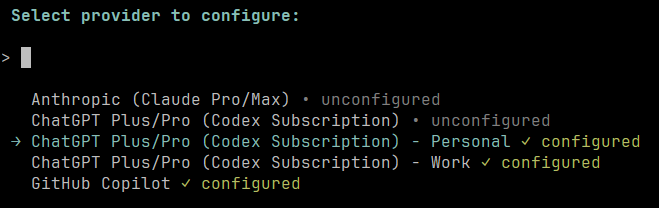
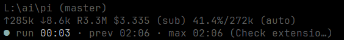

# CarlosGtrz Pi Extensions

A collection of simple [pi](https://github.com/badlogic/pi-mono) extensions I created for personal use.

## Packages

| Package | Description | Install |
| --- | --- | --- |
| [`@carlosgtrz/pi-codex-aliases`](./packages/codex-aliases/README.md) | Adds `openai-codex-work` and `openai-codex-personal` provider frontends for Pi's built-in OpenAI Codex provider, so you can quickly switch accounts without logging in and out.<br><br> | `pi install npm:@carlosgtrz/pi-codex-aliases` |
| [`@carlosgtrz/pi-ansi-tools`](./packages/ansi-tools/README.md) | Adds ANSI-aware `read_ansi`, `write_ansi`, and `edit_ansi` frontends for built-in tools to edit legacy source files. | `pi install npm:@carlosgtrz/pi-ansi-tools` |
| [`@carlosgtrz/pi-terminal-bell`](./packages/terminal-bell/README.md) | Rings the terminal bell when an agent run finishes after a configurable timeout. | `pi install npm:@carlosgtrz/pi-terminal-bell` |
| [`@carlosgtrz/pi-run-timer`](./packages/run-timer/README.md) | Shows elapsed, previous, and longest agent run times in the footer.<br><br> | `pi install npm:@carlosgtrz/pi-run-timer` |

## Development

```bash
npm install
npm run check
```

Each package declares a `pi` manifest in its `package.json`, so Pi can discover the extension entrypoint after installation.

## License

MIT
